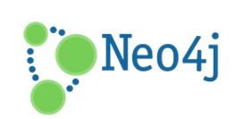
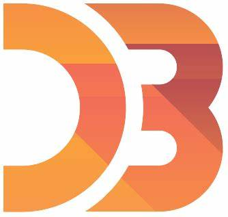

# Hi there 👋🏾 I am Obed

	
	
	

---

## 📝 My Blog Posts:
:
---

---
## Databases

	
	
	
	

## 🧑‍💻 Developer/Forums

	
	
	
	

## 📑 Documentation Platforms

<!--## 🎓 Education 	
-->

## Languages

 
	 
	 
	 
	 
	

---
## 📚 Tools and Platforms

	 
	 
	 
	
	

---
## 🚅🚅FrontEnd Stack

	
	
	
	 
	
	 
	 
	
	
	 
	
	 
	
	
	
	

---
---
## 💾 Server Side/Backend/apis

	
	
	
	
	
	 
	 
	
	  
	 
	 
	
	
	 

<!---->
<!--

-->
<!--
**obedNuertey1/obedNuertey1** is a ✨ _special_ ✨ repository because its `README.md` (this file) appears on your GitHub profile.

Here are some ideas to get you started:

- 🔭 I’m currently working on ...
- 🌱 I’m currently learning ...
- 👯 I’m looking to collaborate on ...
- 🤔 I’m looking for help with ...
- 💬 Ask me about ...
- 📫 How to reach me: ...
- 😄 Pronouns: ...
- ⚡ Fun fact: ...
-->
